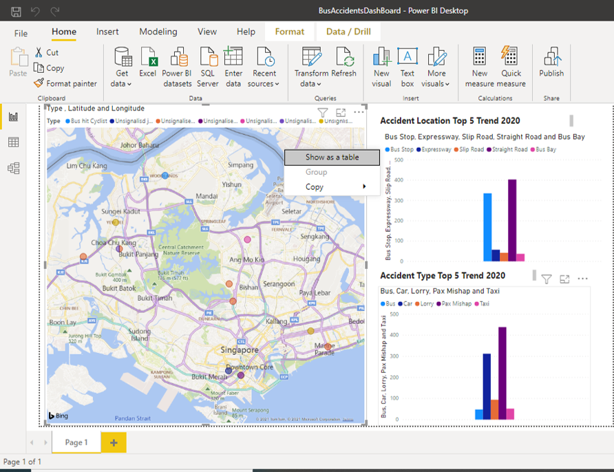

# VisualisationsOfAccidents
This is an interesting way of Visualising Accident Data using PowerBI
The main idea objective is to display the accident location on the Singapore Map and to find out the location of the accident and the accident type.

